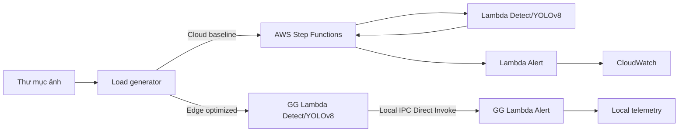

# Kịch bản demo và nội dung đưa vào báo cáo

## 1. Câu hỏi nghiên cứu

**RQ:** Khi giữ nguyên mô hình AI, ảnh đầu vào và logic cảnh báo, điều phối cục bộ
giữa hai hàm tại Edge giảm End-to-End Latency và Network I/O bao nhiêu so với điều
phối qua AWS Step Functions?

Giả thuyết H1: Edge Direct Invoke có p50/p95 thấp hơn Cloud. Giả thuyết H2: Edge
không gửi ảnh/kết quả trung gian lên cloud nên giảm application-layer Network I/O.

## 2. Liên hệ với bài báo 2605.04316v1

Demo là một lát cắt thực nghiệm của kiến trúc bài báo, không phải tái hiện toàn bộ
Edge–Cloud–Space continuum:

| Bài báo | Vấn đề | Thành phần trong demo |
|---|---|---|
| BA6 | Remote state có thể chi phối latency/bandwidth | Giữ ảnh và state trung gian tại edge |
| BA7 | Handoff giữa các hàm không miễn phí | Co-location + Direct Invoke Detect → Alert |
| BA9 | Điều phối tập trung phụ thuộc kết nối/telemetry | Edge vẫn hoàn tất khi ngắt uplink |
| IC4 | Cần primitive cho data locality/function-state fusion | Local orchestrator và Greengrass IPC |
| Function execution layer | FaaS runtime, controller, telemetry | Lambda components + log/metrics |

Phạm vi này **không** kiểm chứng contact window, LEO placement, energy/thermal hay
migration (BA1–BA5). Nêu rõ giới hạn đó để tránh suy diễn quá mức từ bài báo.

## 3. Kiến trúc demo



Trong triển khai thật, Cloud chỉ truyền `bucket/key` trong Step Functions vì state
có giới hạn kích thước và không nên chứa ảnh base64. Network I/O phải lấy từ
interface/OS hoặc AWS metrics; con số mô phỏng chỉ đếm payload tầng ứng dụng.

## 4. Biến thực nghiệm

- Biến độc lập: `mode ∈ {cloud, edge}` và tốc độ gửi `rate ∈ {1, 5, 10, 20}` ảnh/s.
- Biến phụ thuộc: E2E p50/p95/p99, throughput, success rate, network bytes, CPU,
  peak RSS.
- Biến kiểm soát: cùng ảnh, model/weights, confidence threshold, CPU/memory,
  số worker, warm/cold state, số request và thứ tự ảnh.
- Mỗi cấu hình: warm-up 10 request; đo tối thiểu 30 (tốt hơn là 100); lặp 5 lần;
  báo cáo median và khoảng biến thiên/IQR.

Định nghĩa latency: `t(Alert hoàn tất) - t(request được lên lịch)`. Vì vậy latency
bao gồm cả queueing khi tải vượt khả năng xử lý. `service_latency_ms` trong CSV là
thời gian chỉ tính từ khi worker bắt đầu chạy.

## 5. Các lệnh trình diễn

```bash
python3 -m unittest discover -s tests -v

python3 -m edge_demo.cli benchmark \
  --images sample_images --requests 60 --rate 5 --workers 4 \
  --output results/rate_05

python3 -m edge_demo.cli benchmark \
  --images sample_images --requests 60 --rate 20 --workers 4 \
  --output results/rate_20
```

Muốn tạo độ trễ cloud mô phỏng theo RTT đã đo:

```bash
python3 -m edge_demo.cli benchmark --images sample_images --requests 60 --rate 10 \
  --uplink-ms 45 --transition-ms 25 --downlink-ms 45
```

## 6. Bảng kết quả nên dùng

| Rate | Mode | Success | Throughput | E2E p50 | E2E p95 | Network MB | CPU % | Peak RAM |
|---:|---|---:|---:|---:|---:|---:|---:|---:|
| 5 | Cloud | điền số đo | | | | | | |
| 5 | Edge | điền số đo | | | | | | |
| 20 | Cloud | điền số đo | | | | | | |
| 20 | Edge | điền số đo | | | | | | |

Ba biểu đồ đủ cho báo cáo: (1) p50/p95 theo rate, (2) throughput và success rate
theo rate, (3) Network I/O cùng CPU/RAM. Không chọn một lần chạy đẹp nhất; dùng
trung vị của các lần lặp.

## 7. Lời thoại demo ngắn

“Hai nhánh dùng cùng detector và cùng hàm cảnh báo. Nhánh Cloud có ba phần overhead:
upload, state transition và download/kết quả. Nhánh Edge giữ dữ liệu tại nơi sinh ra
và gọi hàm Alert qua local IPC. Đây chính là tối ưu composition/data locality mà bài
báo đề xuất cho BA6, BA7 và IC4. Khi tăng rate, ta quan sát p95 và queueing thay vì
chỉ nhìn average. Success 100% ở đây chỉ nói không mất request, không phải độ chính
xác nhận diện 100%.”

## 8. Checklist triển khai AWS thật

1. Greengrass Core v2 chạy trên VM/edge; cố định vCPU/RAM và ghi cấu hình máy.
2. Hai Lambda component pinned, warm-up trước đo; Lambda Detect được cấp quyền local
   invoke Lambda Alert.
3. Cloud baseline dùng ASL trong `aws/step_functions/state_machine.json`; ảnh ở S3.
4. Mỗi request có UUID xuyên suốt; log bốn timestamp để phát hiện mất/trùng.
5. CloudWatch Logs Insights/EMF lấy duration; `psutil`, `/usr/bin/time -v`, hoặc
   container metrics lấy CPU/RSS; `psutil.net_io_counters`/OS lấy network bytes.
6. Chạy thêm thí nghiệm ngắt mạng: Edge phải tiếp tục xử lý và buffer telemetry;
   Cloud baseline sẽ timeout/defer. Đây là minh họa BA9, không trộn vào biểu đồ
   latency khi mạng bình thường.

## 9. Cách diễn giải kết luận

Chỉ kết luận “giảm X%” sau khi có số đo AWS thật. Công thức:

`reduction = (p50_cloud - p50_edge) / p50_cloud × 100%`.

Nếu CPU/RAM Edge tăng, không gọi đó là “tối thiểu”; hãy báo cáo trade-off: đổi thêm
tài nguyên cục bộ lấy latency thấp, bandwidth nhỏ và khả năng tiếp tục khi mất mạng.
